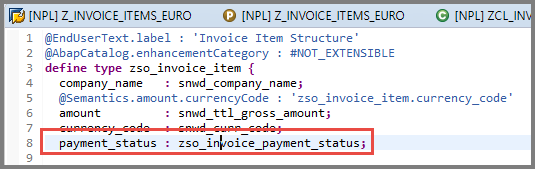
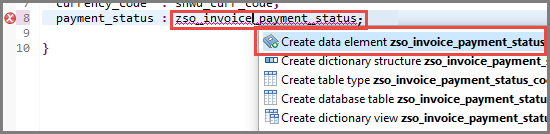
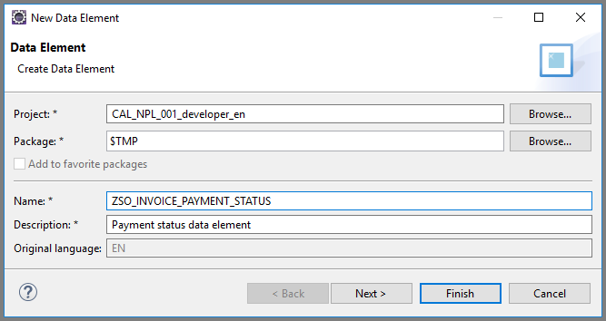

## Prerequisites  
 - You have a valid instance of an on-premise AS ABAP server, version 7.51 or higher (some ABAP Development Tools may not be available in earlier versions)
 - **Tutorial**: [Create an ABAP Project in ABAP Development Tools (ADT)](abap-create-project)

## Details
### You will learn  
- How to create a data element.
- How to use this data element to provide Boolean logic to one of the columns in the table

---

[ACCORDION-BEGIN [Step 1: ](Change field type to new data element)]
Go back to your ABAP Dictionary structure `zso_invoice_item` and change the type of field `payment_status` to **`zso_invoice_payment_status`**:

Since the data element `zso_invoice_payment_status` does not exist, you get a syntax error, which you will fix using a quick fix below.

[DONE]
[ACCORDION-END]

[ACCORDION-BEGIN [Step 2: ](Choose a Quick Fix)]

1. Select the data element and display all the available Quick Fixes by choosing **`Ctrl+1`**.

2. Then choose **Create data element `zso_invoice_payment_status`** and choose **Enter**.

    

[DONE]
[ACCORDION-END]

[ACCORDION-BEGIN [Step 3: ](Create a new data element)]

Enter a description for the new data element in the field **Description**, then choose **Finish** :

[DONE]
[ACCORDION-END]

---