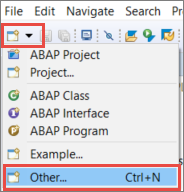
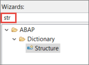
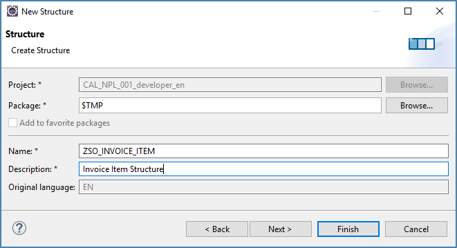
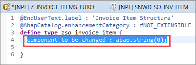

## Prerequisites  
 - You have a valid instance of an on-premise AS ABAP server, version 7.51 or higher (some ABAP Development Tools may not be available in earlier versions)
 - **Tutorial**: [Create an ABAP Project in ABAP Development Tools (ADT)](abap-create-project)

## Details
### You will learn  
- How to create an Data Dictionary structure

---

[ACCORDION-BEGIN [Step 1: ](Create a global Data Dictionary structure)]

Now, you will create a global Data Dictionary ("DDIC") structure: In the toolbar, select **New**, then choose **Other ABAP Repository Object**.

[DONE]
[ACCORDION-END]

[ACCORDION-BEGIN [Step 2: ](Filter the list of object types)]

In the wizard that appears, filter the list of ABAP repository object types by entering `**struct**`.

[DONE]
[ACCORDION-END]

[ACCORDION-BEGIN [Step 3: ](Enter name and description)]

Then enter the following and choose **Finish**.
- Name = **`ZSO_INVOICE_ITEM`**
- Description = for example, **Invoice item structure**

A new text editor is opened showing the content of the newly created Data Dictionary structure.

[DONE]
[ACCORDION-END]

[ACCORDION-BEGIN [Step 4: ](Remove the generated component)]

Remove the generated example component `component_to_be_changed` from the structure:

[DONE]
[ACCORDION-END]

---
